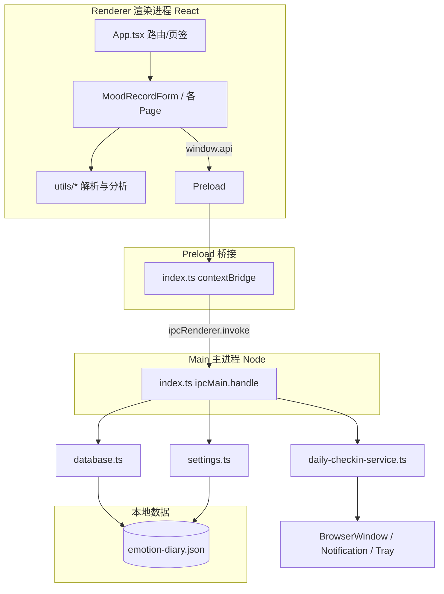

# 情绪记录（Windows）

本地离线情绪日记桌面应用：**Electron + React + TypeScript**，数据存于用户目录下的 **JSON 文件**（无 SQLite / 无原生编译依赖）。

仓库地址：<https://github.com/123yangyan/emotion>

---

## 普通用户：下载即用

**推荐方式**（无需安装 Node.js）：

1. 打开 [GitHub Releases](https://github.com/123yangyan/emotion/releases)
2. 下载最新版的 **`情绪记录 Setup x.x.x.exe`**
3. 双击安装，从开始菜单或桌面启动
4. 首次运行可在托盘找到图标；数据保存在本机，可在设置页导出 JSON

> 若 Releases 尚无安装包：维护者需打标签 `v1.0.0` 触发自动打包，或本地执行 `npm run dist` 后手动上传（见下文「维护者发布」）。

**系统要求**：Windows 10 / 11（64 位）

---

## 开发者：从源码运行

**环境**：Node.js 18+、npm 9+、Windows（打包 EXE 时）

```bash
git clone https://github.com/123yangyan/emotion.git
cd emotion
npm install
npm run dev      # 开发（改 preload/主进程需完全重启应用）
npm run build    # 编译到 out/
npm run dist     # 打包安装包 → release/
```

数据文件路径：`%APPDATA%/emotion-diary/data/emotion-diary.json`（设置页可查看确切路径）。

国内网络慢时，项目已配置 `.npmrc` 使用 npmmirror；也可临时改用官方源：`npm install --registry=https://registry.npmjs.org`。

---

## 维护者发布

### 首次推送代码到 GitHub

```powershell
cd 项目目录
git init
git add .
git commit -m "chore: initial release v1.0.0"
git branch -M main
git remote add origin https://github.com/123yangyan/emotion.git
git push -u origin main
```

也可运行脚本：`powershell -ExecutionPolicy Bypass -File scripts/publish-to-github.ps1`

### 发布带安装包的 Release（推荐）

```bash
git tag v1.0.0
git push origin v1.0.0
```

推送 `v*` 标签后，GitHub Actions（`.github/workflows/release.yml`）会自动在 Windows 环境执行 `npm run dist`，并将 `release/` 下的安装包上传到 Releases。

---

## 架构与文件说明（开发者 / AI）

以下章节说明设计逻辑、进程架构、数据流，以及每个源文件的职责，便于安全地定位修改点。

---

## 设计目标与核心逻辑

### 产品定位

帮助用户在 Windows 上**低摩擦记录**一次情绪事件，并在事后通过**历史列表**与**分析全景**回顾模式。强调：

- 本地优先、可导出 JSON
- 定时提醒打卡（托盘 + 置顶小窗），保存后仍按间隔重复提醒
- 记录结构贴近 CBT / 情绪日记：**事实 → 想法 → 情绪 + 强度 → 身心反应**

### 一条记录存什么（领域模型）

渲染层用 **camelCase 表单状态**；持久化用 **snake_case 行**（`EntryRow`）。数组字段在 DB 里以 **JSON 字符串** 存储。

| 概念 | 表单 / 展示 | 持久化字段 | 说明 |
|------|-------------|------------|------|
| 事实场景 | `factTags` + `factSupplement` | `fact` | 标签用 `、` 拼接；补充以 `补充说明:` 前缀写入同一字符串 |
| 主观想法 | `thoughtTags` + `thoughtNote` | `thought` | 预设胶囊 + 自由文本，同样 `、` 拼接 |
| 情绪 | `emotionIds[]` | `emotion_ids` | JSON 数组，通常 1 个主情绪 id |
| 强度 | `intensity` 1–9 | `intensity` | 与 `IntensityEnergyBar`、色阶 `intensityTheme` 一致 |
| 身体 / 行为 | `bodyTags`, `behaviorTags` | `body_tags`, `behavior_tags` | JSON 数组 |
| 发生时间 | 界面显示本地时间 | `occurred_at` | ISO 字符串 |
| 备注 | `reactionNote` | `reaction_note` | 身心反应区自由备注 |

解析展示逻辑集中在 `utils/entryParse.ts`；历史单行摘要见 `utils/historyRowPreview.ts`；编辑回填见 `utils/entryFormRestore.ts`。

### 双入口、单表单

**同一条记录 UI** 由 `MoodRecordForm` 驱动，两种 `variant`：

| 入口 | 组件链 | 说明 |
|------|--------|------|
| 主窗口「记录」 | `RecordForm` → `MoodRecordForm(page)` | 全页布局 |
| 提醒小窗 | `?mode=checkin` → `CheckInPanel` → `MoodRecordForm(popup)` | 独立 `BrowserWindow`，URL 参数区分 |

三块内容区（情绪 / 事实·想法 / 身心反应）的布局与交互在 `CheckInDualForm`；强度条在 `IntensityEnergyBar`（记录页与弹窗共用）。

### 提醒策略（主进程）

`daily-checkin-service.ts` 定时轮询（间隔由 `getCheckPollIntervalMs` 决定，约为用户设置间隔的一半）：

- **静默时段**内不弹（`settings.quietStart` / `quietEnd`）
- **保存记录后仍继续按间隔提醒**（不因「今日已有记录」而永久停止）
- 支持 **稍后（snooze）**：当日最多 3 次，间隔约 20 分钟
- 高强度记录可配合 `nudges` 表做跟进（通知 + 小窗，逻辑在同文件及 `database`）

修改提醒行为时，同时检查：`settings.ts`、`daily-checkin-service.ts`、`index.ts` 的 `restartCheckInTimer`。

---

## 架构总览



### 进程职责

| 进程 | 目录 | 职责 |
|------|------|------|
| **Main** | `src/main/` | 窗口、托盘、IPC、读写 JSON、系统通知、提醒定时器 |
| **Preload** | `src/preload/` | 把 IPC 封装为 `window.api`（`contextIsolation: true`） |
| **Renderer** | `src/renderer/src/` | 全部 UI、图表、文案；**禁止**直接 `fs` / `require('electron')` |

### 修改代码时的硬约束

1. **新增能力**：Renderer → 在 `preload/index.ts` + `preload/index.d.ts` 暴露 → `main/index.ts` 注册 `ipcMain.handle` → 实现于 `database.ts` 或对应 service。
2. **改文案**：优先只改 `renderer/src/i18n/zh.ts`。
3. **改标签默认值**：`data/emotions.ts` + `data/tagLists.ts`；用户自定义存在 settings 的 `tagLists` 字段。
4. **改样式**：全局在 `renderer/src/index.css`；组件用 BEM 风格类名（如 `history-row`, `energy-bar`）。
5. **Preload / 主进程变更后必须重启应用**，仅改 React 可热更新。

---

## IPC 契约（`window.api`）

| Preload 方法 | IPC Channel | 实现位置 | 用途 |
|--------------|-------------|----------|------|
| `createEntry` | `entry:create` | `database.createEntry` | 新建；触发 `onDailyRecordSaved` |
| `listToday` | `entry:listToday` | `listEntriesByDate` | 今日曲线 / 当日列表 |
| `listEntriesBetween` | `entry:listBetween` | `listEntriesBetween` | 分析页按时间范围 |
| `listAllEntries` | `entry:listAll` | `exportAllEntries` 排序 | 历史页全量 |
| `getEntry` / `updateEntry` | `entry:get` / `entry:update` | `database` | 历史编辑 |
| `deleteEntry` | `entry:delete` | `deleteEntry` | 单条删除 |
| `deleteEntries` | `entry:deleteMany` | `deleteEntries` | 批量删除（ID 会 `Number` 归一化） |
| `getSettings` / `saveSettings` | `settings:get` / `settings:save` | `settings.ts` | 保存后重启提醒定时器 |
| `getDailyTitle` / `setDailyTitle` | `dailyTitle:*` | `database` key-value | 曲线页「气象命名」 |
| `exportJson` | `export:json` | 主进程写文件对话框 | 导出 |
| `getDataPath` | `app:getDataPath` | — | 设置页展示路径 |
| `openCheckInPopup` | `checkin:open` | `openCheckInWindow` | 手动打开打卡窗 |
| `scheduleTestReminder` 等 | `reminder:*` | `daily-checkin-service` | 设置页测试提醒 |
| `snoozeCheckIn` | `checkin:snooze` | `recordCheckInSnooze` | 弹窗稍后 |

类型定义：`preload/index.d.ts`（全局 `Window.api`）。

---

## 页面与顶栏路由（`App.tsx`）

| 页签 id | 组件 | 可见性 | 作用 |
|---------|------|--------|------|
| `record` | `RecordForm` | 默认显示 | 新建记录 |
| `history` | `EntryHistoryPage` | 显示 | 全量历史、分页、多选删除、编辑 |
| `chart` | `DayChart` | **`SHOW_CHART_TAB = false` 时隐藏** | 当日折线 + 因果链画布 |
| `analysis` | `AnalysisPage` | 显示 | 全景舱：潮汐时间轴 + 切片卡片 + 高频统计 |
| `settings` | `SettingsPage` | 显示 | 提醒、勿扰、标签词表、导出 |

`tagListsVersion`：设置页保存标签后递增，强制各页重新 `resolveTagLists()`。

弹窗模式：`?mode=checkin` 时只渲染 `CheckInPanel`，无顶栏。

---

## 目录与文件职责

```
项目/
├── electron.vite.config.ts    # 三端构建：main / preload / renderer
├── package.json
├── resources/                 # 托盘图标（打包进 extraResources）
└── src/
    ├── shared/types.ts        # AppSettings、TagListsConfig（主/renderer 共用）
    │
    ├── main/                  # ★ 主进程
    │   ├── index.ts           # 应用入口：窗口、托盘、IPC 注册、提醒定时器
    │   ├── database.ts        # JSON 读写；Entry CRUD；nudges/personas；导出
    │   ├── settings.ts        # 设置读写、静默时段、提醒间隔下限
    │   ├── daily-checkin-service.ts  # 定时提醒、打卡窗、测试提醒、snooze
    │   └── trayIcon.ts        # 加载托盘 PNG
    │
    ├── preload/
    │   ├── index.ts           # contextBridge → window.api
    │   └── index.d.ts         # ElectronAPI 类型
    │
    └── renderer/
        ├── index.html
        └── src/
            ├── main.tsx       # React 挂载
            ├── App.tsx        # 页签路由、toast、checkin 分流
            ├── index.css      # 全局样式（含 history/panorama/energy-bar）
            ├── env.d.ts
            │
            ├── i18n/zh.ts     # ★ 所有界面中文文案
            │
            ├── data/
            │   ├── emotions.ts    # 内置情绪词典、四象限、身体/行为/场景/想法默认标签
            │   └── tagLists.ts    # defaultTagLists、resolveTagLists、buildEmotionLabelMap
            │
            ├── components/
            │   ├── RecordForm.tsx         # 记录页薄封装 → MoodRecordForm
            │   ├── MoodRecordForm.tsx     # ★ 核心表单：新建/编辑/弹窗；保存调 api
            │   ├── CheckInDualForm.tsx    # 事实|想法双栏 + 身心反应区布局
            │   ├── CheckInPanel.tsx         # 弹窗外壳（稍后、关闭）
            │   ├── IntensityEnergyBar.tsx   # 1–9 强度条（色阶、点击分段）
            │   ├── EmotionQuadrantGrid.tsx  # 情绪四象限点选
            │   ├── TagChipFlow.tsx          # 标签胶囊流式选择
            │   │
            │   ├── EntryHistoryPage.tsx     # 历史列表、分页、多选删除、进入编辑
            │   ├── AnalysisPage.tsx         # 分析页容器：范围切换 + 子组件编排
            │   ├── DayChart.tsx             # 今日曲线（Recharts）+ 日标题
            │   ├── CauseChainCanvas.tsx     # 曲线页因果链可视化（仅 chart 使用）
            │   ├── SettingsPage.tsx         # 设置表单
            │   ├── SettingsTagLists.tsx     # 标签词表编辑器
            │   │
            │   └── panorama/                # 分析页「全景舱」子模块
            │       ├── PanoramaTimeline.tsx # 潮汐折线（强度随时间）
            │       ├── SnapshotCard.tsx     # 选中时刻切片详情
            │       └── FrequencyPanel.tsx   # 标签/情绪高频统计
            │
            └── utils/
                ├── entryParse.ts          # EntryRow → ParsedEntry；fact/thought 拆分解析
                ├── entryFormRestore.ts    # EntryRow → 表单 state（编辑用）
                ├── historyRowPreview.ts   # 历史单行视图；HISTORY_PAGE_SIZE=10
                ├── dayAnalytics.ts        # 当日统计、极性、因果链等（曲线/分析共用）
                ├── panoramaAnalytics.ts   # 分析页时间范围、频度、PanoramaPoint
                ├── intensityTheme.ts      # 强度 1–9 颜色插值（蓝→红）
                └── formatTime.ts          # 本地时间格式化
```

---

## 关键模块说明（给 AI 的修改指引）

### 要改「记录表单字段」

1. `MoodRecordForm.tsx` — state、校验、保存时组装 `EntryInput`
2. `CheckInDualForm.tsx` — 若涉及事实/想法/身心布局
3. `entryParse.ts` / `entryFormRestore.ts` — 解析与回填
4. `database.ts` — 仅当需新增持久化列
5. `historyRowPreview.ts` — 若历史列表要展示新字段
6. `i18n/zh.ts` — 文案

### 要改「历史页」

- 主文件：`EntryHistoryPage.tsx`
- 样式：`index.css` 中 `.history-*`
- 批量删除：优先 `deleteEntries` IPC；列表 ID 必须为 `number`

### 要改「分析页」

- 容器：`AnalysisPage.tsx`
- 算法：`panoramaAnalytics.ts`、`dayAnalytics.ts`
- 图表 UI：`panorama/*`；样式 `.panorama-*`

### 要改「提醒 / 弹窗」

- 逻辑：`daily-checkin-service.ts`
- 设置项：`settings.ts`、`shared/types.ts`、`SettingsPage.tsx`
- 弹窗 UI：`CheckInPanel.tsx`、`MoodRecordForm` 的 `variant="popup"`

### 要改「强度条 / 颜色」

- 组件：`IntensityEnergyBar.tsx`
- 色值：`intensityTheme.ts`
- 样式：`.energy-bar` in `index.css`

### 要隐藏/恢复「今日曲线」页签

- `App.tsx` 中 `SHOW_CHART_TAB`（组件 `DayChart` 仍保留）

---

## 数据文件结构（`emotion-diary.json`）

```json
{
  "entries": [ { "id", "fact", "thought", "body_tags", "behavior_tags", ... } ],
  "personas": [],
  "nudges": [ { "id", "entry_id", "fire_at", "status" } ],
  "settings": { "reminderIntervalHours": "2", "tagLists": "...", ... },
  "counters": { "entry": 0, "persona": 0, "nudge": 0 }
}
```

`settings` 内多为字符串键值；`tagLists` 为 JSON 字符串化的 `TagListsConfig`。

---

## 构建产物

| 路径 | 内容 |
|------|------|
| `out/main/` | 主进程 bundle |
| `out/preload/` | preload bundle |
| `out/renderer/` | 静态前端 |
| `release/` | `npm run dist` 生成的安装包 |

---

## 常见陷阱

- **Renderer 不能直接访问文件系统**，必须走 IPC。
- **ID 类型**：JSON 里 id 应为数字；删除/查找处已做 `Number()` 归一化，新增代码请保持一致。
- **fact / thought 拼接规则** 与 `entryParse` 必须同步，否则分析和历史摘要会错位。
- **修改 preload 或 main 后**需完全退出 Electron 再 `npm run dev`，否则 `window.api` 可能是旧版。
- 项目路径含中文时，部分终端工具可能报路径错误；用 Cursor 内置工具或 `Set-Location` 到项目目录执行命令。

---

## 功能清单（用户可见）

- **记录**：事实 / 想法分栏、情绪词典、强度 1–9、身心反应标签
- **历史**：单行列表、每页 10 条、页码跳转、多选批量删除、单条编辑/删除
- **分析**：日/周/月范围、潮汐图、时刻切片、高频标签统计
- **今日曲线**（页签可隐藏）：日折线图、气象命名、因果链
- **设置**：提醒间隔、勿扰、通知与强弹窗、自定义标签、导出 JSON、测试提醒
- **跟进提醒**：打卡窗 + 系统通知；保存后仍按间隔提醒

---

## 延伸阅读（代码内注释）

复杂交互以源文件内中文注释为准；本 README 侧重 **边界与文件职责**，细节实现请跳转到上表对应文件。
