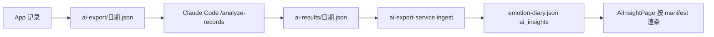
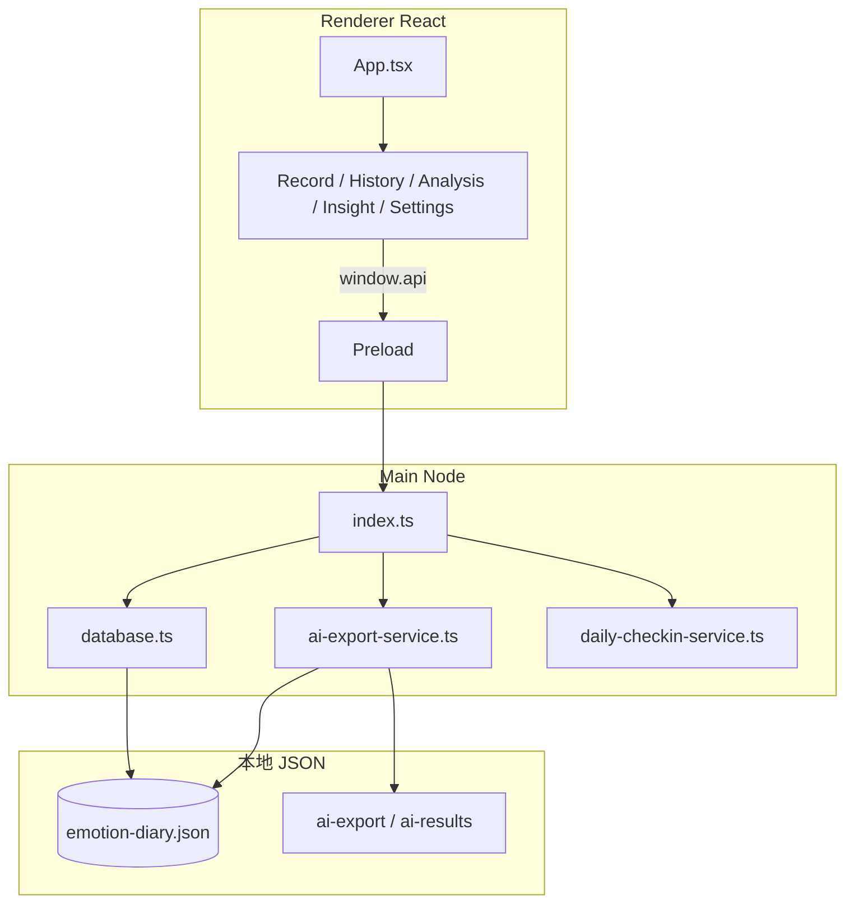

# 情绪记录（Windows）v3.6.0

本地离线情绪日记桌面应用：**Electron + React + TypeScript**，数据存于用户目录下的 **JSON 文件**（无 SQLite / 无原生编译依赖）。

仓库地址：<https://github.com/123yangyan/emotion>

---

## 普通用户：下载即用

**推荐方式**（无需安装 Node.js）：

1. 打开 [GitHub Releases](https://github.com/123yangyan/emotion/releases)
2. 下载最新版的 **`emotion-diary-setup-x.x.x.exe`**
3. 双击安装，从开始菜单启动（安装后若快捷方式图标未刷新，可取消任务栏固定后重新固定）
4. 托盘为四象限小图标；数据保存在本机

> 推送 `v*` 标签后，GitHub Actions 会自动打包并上传到 Releases；也可本地 `npm run dist`。

**系统要求**：Windows 10 / 11（64 位）

### 主要功能

| 功能 | 说明 |
|------|------|
| **记录** | 左栏任务坐标（价值感 × 耗能四象限）+ 右栏日记正文 |
| **历史** | 日记列表、分页、编辑/删除 |
| **分析** | 全景舱：时间轴、切片卡片、高频统计 |
| **AI 洞察** | 配合 Claude Code 本地分析，App 内展示结构化结论 |
| **设置** | 提醒间隔（分钟）、静默时段、导出备份、检查更新 |

### AI 洞察（可选）

App 支持配合 **Claude Code** 做本地 AI 分析（数据不上云）：

1. 在 App 记录日记并保存（自动写入 `ai-export`）
2. 在项目目录用 Claude Code 运行 `/analyze-records`
3. 回到 App **AI 洞察** 页查看结果（可展开详情、跳转关联日记）

详细步骤、测试数据与**如何自定义 AI 输出字段**，见 [docs/AI使用与修改说明.md](docs/AI使用与修改说明.md)。

测试 UI 时可运行：`npm run seed:ai-insight`（写入示例 `ai-results` 到本机数据目录）。

### 数据与备份

| 路径 | 内容 |
|------|------|
| `%APPDATA%/emotion-diary/data/emotion-diary.json` | 主库（记录 + AI 洞察 + 设置） |
| `%APPDATA%/emotion-diary/data/ai-export/` | 待 AI 分析的每日导出 |
| `%APPDATA%/emotion-diary/data/ai-results/` | Claude Code 写入的分析结果 |

设置页 **「导出 JSON 备份」** 包含全部 `entries` 与 `ai_insights`（结构化对象，含解析后的 `payload`）。

### 更新方式

应用内 **设置 → 检查更新** 仅检测 GitHub 最新版本号；发现新版本后需**手动下载**新安装包并覆盖安装（非应用内静默热更新）。

---

## 开发者：从源码运行

**环境**：Node.js 18+、npm 9+、Windows（打包 EXE 时）

```bash
git clone https://github.com/123yangyan/emotion.git
cd emotion
npm install
npm run dev      # 开发（改 preload/主进程需完全重启应用）
npm run build    # 编译到 out/
npm run dist     # 打包安装包 → release/
npm run seed:ai-insight   # 写入 AI 洞察测试数据（可选）
```

数据目录：`%APPDATA%/emotion-diary/data/`（设置页可查看确切路径）。

---

## 维护者发布

```bash
git tag v3.6.0
git push origin v3.6.0
```

推送 `v*` 标签后，`.github/workflows/release.yml` 在 Windows 上执行 `npm run dist` 并上传 `release/` 安装包。

---

## 设计目标与核心逻辑

### 产品定位

帮助用户在 Windows 上**低摩擦写日记**，并用**任务坐标**标记此刻状态；事后通过历史、分析全景与 **AI 洞察** 回顾模式。

- 本地优先、JSON 备份含 AI 分析
- 定时提醒（托盘 + 置顶小窗），**保存后仍按间隔提醒**
- 记录页：**坐标 + 自由日记**（CBT 坐标系 + 叙事）

### 一条记录存什么

| 概念 | 界面 | 持久化 | 说明 |
|------|------|--------|------|
| 日记正文 | `DiaryInput` | `fact` | 自由文本 |
| 想法（遗留） | — | `thought` | 日记模式下通常为空 |
| 任务坐标 | `ValueEnergyGrid` | `coord_x`, `coord_y` | -4~+4，四象限 |
| 身心/行为 | 弹窗等场景 | `body_tags`, `behavior_tags` | JSON 数组字符串 |
| 发生时间 | 界面显示 | `occurred_at` | ISO 字符串 |
| 疲劳检查 | 18:00 弹窗 | `fatigue_check` | JSON 或 null |

解析：`utils/entryParse.ts`；历史摘要：`utils/historyRowPreview.ts`；编辑回填：`utils/entryFormRestore.ts`。

### 提醒策略

- 默认间隔 **60 分钟**（`reminderIntervalMinutes`）
- 静默时段内不弹；**Esc 稍后**约 20 分钟
- 逻辑：`daily-checkin-service.ts` + `settings.ts`

### AI 数据流



输出契约：`src/shared/aiInsightManifest.ts`；Skill：`.cursor/skills/emotion-diary-ai/`。

---

## 架构总览



### 修改代码时的硬约束

1. **新增 IPC**：`preload` → `main/index.ts` → `database` 或 service
2. **改文案**：`renderer/src/i18n/zh.ts`
3. **改样式**：`renderer/src/index.css`（BEM 类名）
4. **改 preload / main 后必须完全重启** Electron

---

## 页面路由（`App.tsx`）

| 页签 | 组件 | 作用 |
|------|------|------|
| `record` | `RecordForm` → `MoodRecordForm` | 坐标 + 日记 |
| `history` | `EntryHistoryPage` | 历史列表、编辑 |
| `chart` | `DayChart` | 今日曲线（`SHOW_CHART_TAB` 控制显隐） |
| `analysis` | `AnalysisPage` | 全景分析 |
| `insight` | `AiInsightPage` | AI 洞察卡片 |
| `settings` | `SettingsPage` | 提醒、备份、更新 |

弹窗：`?mode=checkin` / `?mode=fatigue_check` → `CheckInPanel`。

---

## 目录要点

```
src/
├── shared/
│   ├── types.ts              # AppSettings 等
│   ├── aiInsightManifest.ts  # AI 输出字段契约（App + Skill 共用）
│   └── aiInsightIngest.ts    # ai-results 解析入库
├── main/
│   ├── database.ts           # JSON 存储、CRUD、exportJsonBackup
│   ├── ai-export-service.ts  # 保存后自动导出、监听 ai-results
│   ├── daily-checkin-service.ts
│   ├── settings.ts
│   ├── update-service.ts     # GitHub API 检查版本
│   └── trayIcon.ts           # 运行时生成四象限托盘/窗口图标
└── renderer/src/
    ├── components/
    │   ├── RecordViewportForm.tsx / DiaryInput.tsx
    │   ├── AiInsightPage.tsx / ai-insight/*
    │   ├── AppUpdatePanel.tsx
    │   └── panorama/*
    ├── utils/aiInsightParse.ts
    └── i18n/zh.ts
```

---

## 数据文件结构

**主库** `emotion-diary.json`：

```json
{
  "entries": [ { "id", "fact", "thought", "coord_x", "coord_y", "body_tags", ... } ],
  "ai_insights": [ { "id", "date", "key_insight", "payload", "patterns", ... } ],
  "personas": [],
  "nudges": [],
  "settings": { "reminderIntervalMinutes": "60", ... },
  "counters": { "entry", "persona", "nudge", "ai_insight" }
}
```

**导出备份**（设置页）：

```json
{
  "format": "emotion-diary-backup",
  "version": 2,
  "exportedAt": "...",
  "entries": [ ... ],
  "ai_insights": [ { "patterns": [], "payload": { ... } } ]
}
```

---

## IPC 摘要（`window.api`）

| 方法 | 用途 |
|------|------|
| `createEntry` / `updateEntry` / `deleteEntry(s)` | 记录 CRUD |
| `getSettings` / `saveSettings` | 设置（分钟间隔等） |
| `exportJson` | 备份 entries + ai_insights |
| `getAiInsights` / `getLatestAiInsight` | AI 洞察 |
| `checkForUpdate` | GitHub 版本检查 |
| `openCheckInPopup` / `snoozeCheckIn` | 提醒弹窗 |

完整列表见 `preload/index.ts` 与 `preload/index.d.ts`。

---

## 常见陷阱

- Renderer **不能直接**读写文件系统，必须走 IPC。
- 修改 **preload / main** 后需完全退出再启动。
- AI 输出字段变更：先改 `aiInsightManifest.ts`，再同步 `.claude/commands` 与 Skill 文档。
- Windows 覆盖安装后快捷方式图标可能缓存旧图，见上文「下载即用」说明。

---

## 功能清单（v3.6.0）

- **记录**：四象限坐标 + 日记正文；Enter 保存
- **历史**：日记风格列表、编辑、批量删除
- **分析**：日/周/月全景舱
- **AI 洞察**：manifest 驱动展示；关联 entry 跳转历史
- **设置**：提醒间隔（分钟）、静默、疲劳检查、JSON 备份（含 AI）、GitHub 更新检查
- **提醒**：托盘四象限图标 + 打卡小窗

---

## 延伸阅读（产品方向）

1. **核心层**：锚定真实自我，区分现状与理想镜像  
2. **输入层**：结构化知识喂养，拓宽感知  
3. **执行层**：5% 微迭代，AI 拆解可执行动作  
4. **反馈层**：记录高能瞬间，观察身心不一致  

详见项目内规划文档与 [docs/AI使用与修改说明.md](docs/AI使用与修改说明.md)。
