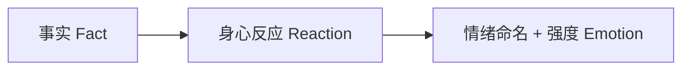
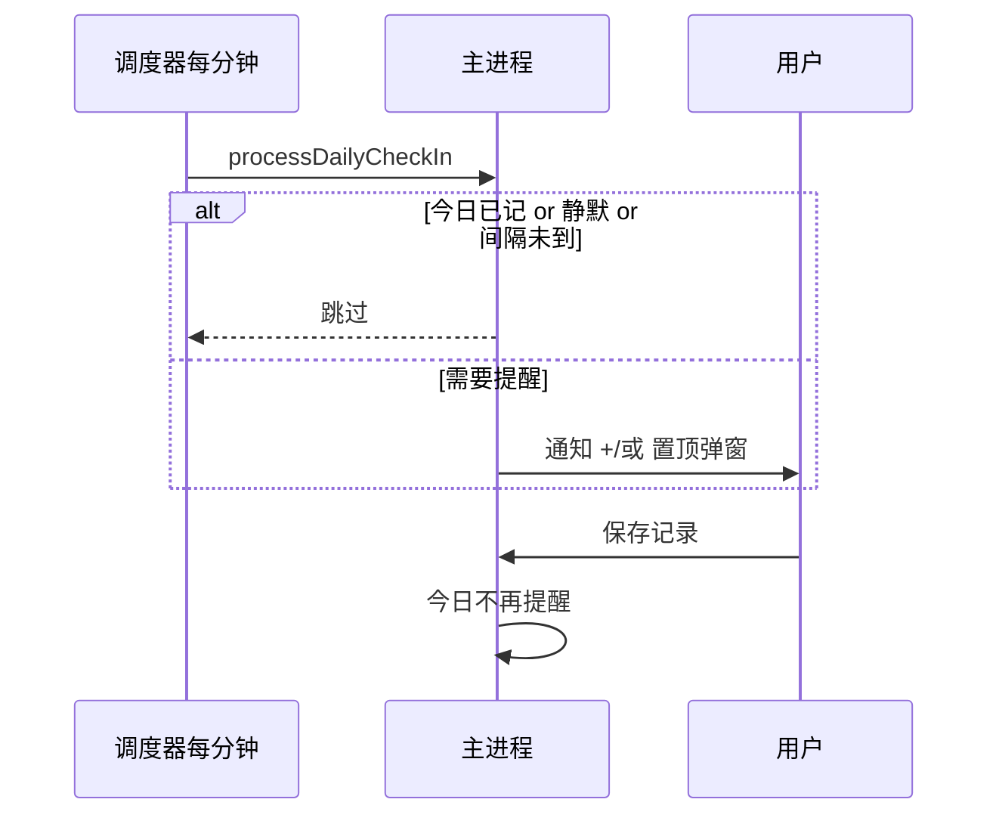

# 情绪记录（Windows 版）产品需求文档 PRD

| 项目 | 内容 |
|------|------|
| **文档版本** | v2.2 |
| **状态** | 已与当前实现对齐（持续迭代） |
| **更新日期** | 2026-05-17 |
| **产品形态** | Windows 桌面应用（开发期 `npm run dev`，发布为 `.exe`） |
| **目标用户** | 单人自用（本机离线） |

---

## 目录

1. [背景与目标](#1-背景与目标)  
2. [产品定位与原则](#2-产品定位与原则)  
3. [用户与场景](#3-用户与场景)  
4. [范围说明](#4-范围说明)  
5. [核心理论映射（情境—成因链）](#5-核心理论映射情境成因链)  
6. [信息架构与页面](#6-信息架构与页面)  
7. [功能需求详述](#7-功能需求详述)  
8. [提醒规则](#8-提醒规则)  
9. [数据模型](#9-数据模型)  
10. [文案与交互规范](#10-文案与交互规范)  
11. [视觉与情感化设计](#11-视觉与情感化设计)  
12. [技术方案（已定）](#12-技术方案已定)  
13. [非功能需求](#13-非功能需求)  
14. [验收标准](#14-验收标准)  
15. [版本规划](#15-版本规划)  
16. [风险与待决事项](#16-风险与待决事项)  
17. [附录](#17-附录)  

---

## 1. 背景与目标

### 1.1 背景

情绪在体验上常像一个「黑箱」：用户只感到难受或激动，却说不清**发生了什么、身体怎样反应、如何命名**。心理学与正念练习强调：

- 用 **客观事实** 与评判分离（认知解离）；  
- 用 **接纳** 而非「消灭情绪」的语言；  
- 情绪强度会随时间 **动态变化**，值得被记录与看见。

本产品将上述方法转化为 **结构化点选记录 + 日折线回顾 + 每日温和提醒**，帮助用户在 Windows 电脑上自助梳理情绪。

### 1.2 产品目标

| 目标 | 衡量方式 |
|------|----------|
| **能记** | 单屏点选为主，1～2 分钟内完成一条记录 |
| **能看** | 当日情绪强度折线图一目了然 |
| **能提醒** | 今日未记录时按间隔弹窗/通知；保存后今日不再打扰 |
| **能定制** | 情绪 / 事实 / 身心反应标签可在设置中增删改 |
| **能安心** | 数据仅存本机，无账号服务器、无云同步 |

### 1.3 非目标

- 不替代心理咨询或精神科诊疗。  
- 不提供危机干预热线集成。  
- 不做社区、分享、排行榜等多人功能。

---

## 2. 产品定位与原则

### 2.1 一句话定位

> **Windows 本机情绪日记**：用紧凑点选完成「事实—身心—情绪—强度」记录，用折线图看见一天内的强度变化，用可配置的每日提醒与置顶弹窗促成记录习惯。

### 2.2 设计原则

| 原则 | 说明 |
|------|------|
| **简单直接** | 记录页单屏分区点选，少滚动、少长文 |
| **颗粒度适中** | 事实 / 身心 / 情绪分层，控件以标签（Chip）为主 |
| **接纳式文案** | 避免「战胜、消灭、克服」；使用「留意、允许、记录」 |
| **本地优先** | 离线 JSON 存储，单人使用 |
| **弱导航、强内容** | 顶栏单行弱展示，把视口留给记录区 |
| **情感化界面** | 暖色背景、柔和阴影、强度色彩渐变，减少「临床冷感」 |
| **标签可配置** | 三类标签词表可在设置中维护，持久化到本地 |

---

## 3. 用户与场景

### 3.1 用户画像

- **角色**：产品使用者本人（唯一用户）。  
- **设备**：Windows 10 / 11 个人电脑。  
- **技能**：能运行开发预览或安装 `.exe`，能授权 Windows 通知。  
- **诉求**：记录真实、提醒别忘、标签贴合个人习惯、数据不上传云端。

### 3.2 核心场景

| 编号 | 场景 | 用户行为 | 系统响应 |
|------|------|----------|----------|
| S1 | 情绪波动后记录 | 打开「记录」→ 点选强度/情绪/事实/身心 → 保存 | 写入本地 JSON；今日已记录则不再自动提醒 |
| S2 | 查看今天走势 | 切换到「今日曲线」 | 按时间绘制强度 1～9 折线 |
| S3 | 收到每日提醒 | 到点收到通知/置顶弹窗 | 打开与主记录相同的紧凑录入窗（`mode=checkin`） |
| S4 | 自定义标签 | 设置 → 记录标签管理 → 增删改胶囊标签 → 保存设置 | 记录页同步新词表 |
| S5 | 测试提醒 | 设置 → 延迟测试（30 秒 / 1 分钟） | 到时强制弹出提醒（忽略今日已记、静默等限制） |
| S6 | 最小化到托盘 | 关闭主窗口 | 托盘常驻，定时检查仍运行 |

---

## 4. 范围说明

### 4.1 当前版本包含（Must Have）

- Windows 桌面应用（Electron + React + TypeScript）。  
- **紧凑记录页**：强度 1～9（色彩渐变）、情绪（积极/消极分列）、事实点选 + 「+」补充一句、身心反应点选。  
- **今日曲线**（折线图 only）+ 可选「今日气象命名」。  
- **每日提醒**：今日未记录 → 按间隔小时提醒；**静默时段**内不弹；**保存后今日不再提醒**。  
- **系统通知** + **可选强提醒弹窗**（置顶）。  
- **设置页**：提醒间隔、静默时段、通知/弹窗开关、**记录标签管理（流式胶囊）**、延迟测试提醒、立即预览弹窗、导出 JSON。  
- **本地 JSON 存储**（`emotion-diary.json`）。  

### 4.2 明确不做（Won’t Have）

| 不做项 | 说明 |
|--------|------|
| 情绪急救箱 / SOS 锦囊 | 产品方确认不做 |
| 高强度后三次 Nudge 跟进（是/还不太行/稍后） | 已取消，改为每日提醒模型 |
| 主观想法长文录入（独立分栏） | 当前实现不展示，字段保留为空兼容 |
| 情绪词典全量搜索 / 分类 Tab 筛选 | 记录页仅展示可配置常用词表 |
| 多端同步 / 云账号 | 单人本地即可 |
| 分布图、热力图 | 仅需折线图 |
| 纯浏览器网页作为最终交付 | 无法满足强弹窗与托盘后台 |

### 4.3 后续版本候选（Could Have）

- 想法代号管理、持续时长录入回归主表单。  
- 按周/月汇总折线。  
- 标签拖拽排序、隐藏内置词（非删除）。  
- 开机自启、本地密码锁。  

---

## 5. 核心理论映射（情境—成因链）

每条记录（`Entry`）在逻辑上仍对应「情境—成因」链条，**UI 上做了简化以适配快速点选**：



| 层级 | 用户问题 | UI（当前实现） |
|------|----------|----------------|
| **A 事实** | 当时处在什么情境？ | **事实**区：情境标签多选；末尾 **「+」** 可补充一句话（非整行输入框） |
| **C 身心反应** | 身体与行为怎样？ | **身心反应**区：身体感受 + 战/逃/僵 行为标签多选 |
| **D 情绪 + 强度** | 叫什么？多强？ | **情绪**：消极 / 积极两列常用词；**强度** 1～9 数字块（色彩反馈） |

**说明**：`thought`（主观想法）字段在数据层保留，当前版本录入页不展示长文框，便于日后扩展。

---

## 6. 信息架构与页面

### 6.1 导航结构

顶栏 **单行弱展示** + 三 Tab：

```
┌──────────────────────────────────────────────────────────┐
│ 情绪记录 · 每日留意…    [ 记录 ] [ 今日曲线 ] [ 设置 ]   │  ← 低对比、小字号
├──────────────────────────────────────────────────────────┤
│                    （当前页主内容区）                      │
└──────────────────────────────────────────────────────────┘
```

- 顶栏：半透明底 + 细底边，**不占大块竖向空间**。  
- 副标题窄屏可隐藏，优先保证 Tab 可点。

### 6.2 页面说明

| 页面 | 核心内容 |
|------|----------|
| **记录** | 紧凑分区表单（见 §7.1）；顶部仅显示当前时间（自动刷新） |
| **今日曲线** | 日折线图 + 可选「今日气象命名」 |
| **设置** | 提醒、静默、通知/弹窗、**记录标签管理**、延迟测试、预览弹窗、数据路径、导出 |

### 6.3 系统级窗口

| 窗口 | 用途 |
|------|------|
| **主窗口** | 三 Tab |
| **记录弹窗** | `?mode=checkin`，与主记录共用同一表单组件；`alwaysOnTop` |
| **托盘图标** | 关闭主窗口后仍可调度；右键：打开 / 记录心情 / 退出 |

---

## 7. 功能需求详述

### 7.1 情绪录入（P0）

#### 7.1.1 布局原则

- **分区一屏**：强度通栏 + 左情绪 / 右事实与身心（网格），尽量减少纵向滚动。  
- **点选为主**：标签（Chip）多选；避免长列表 + 每行大输入框。  
- **时间**：自动使用当前时间，保存时写入 `occurred_at`（ISO）；记录页只读展示，不提供主表单日期时间选择器。

#### 7.1.2 表单字段

| 区块 | 类型 | 必填 | 说明 |
|------|------|------|------|
| 记录时间 | 自动 | 是 | 保存时取当前时刻 |
| 心情强度 | 1～9 点选 | 是 | 九档按钮；色彩见 §11 |
| 情绪 | 多选标签 | 是 | 至少 1 个；消极 / 积极 **分两列**展示 |
| 事实 | 多选标签 + 可选一句 | 否 | 情境标签；**「+」** 展开行内输入补充 |
| 身心反应 | 多选标签 | 否 | 身体感受 + 行为模式（战/逃/僵） |
| 主观想法 | — | — | v2.1 录入 UI 不展示；库字段留空 |
| 反应简述 | 文本 | 否 | 事实「+」补充可写入 `reaction_note` |

#### 7.1.3 情绪词表（记录页）

- **默认**：消极、积极各约 **8** 个常用词（内置 `QUICK_EMOTION_IDS`）。  
- **来源**：以设置中 **记录标签管理 → 情绪** 为准；保存设置后记录页刷新。  
- **交互**：点选切换选中态；**无**「全部/中性」筛选 Tab。  
- **历史兼容**：完整内置词典仍用于折线图解析旧记录的 `emotion_id`。

#### 7.1.4 事实区

- 标题文案：**「事实」**（非「客观情境」）。  
- **不展示**副文案「点选即可（可多选）」—— 交互自解释。  
- 标签 **流式换行**，**无** 固定高度滚动条。  
- **补充一句**：标签行末尾 **虚线「+」** → 点击变行内输入 → Enter 或失焦生成胶囊标签；再点胶囊可编辑。

#### 7.1.5 身心反应区

- 身体标签（如心跳加快、胸闷…）与行为标签（战斗/逃跑/僵直）**同区展示**。  
- 行为展示名取标签冒号前一段（若含「：」）。  
- 词表来自设置 **身心反应** 配置。

#### 7.1.6 保存与校验

- 校验：至少 1 个情绪标签。  
- 成功：Toast「已记录，今天的心情被留下来了」；弹窗模式下可关闭窗口。  
- 失败：提示重试，不丢已选标签状态。

#### 7.1.7 验收标准

- [ ] 主流程在同一屏完成，无需分步向导。  
- [ ] 强度、情绪、事实、身心四区清晰可见。  
- [ ] 事实区含「+」补充，无底部整行大输入框。  
- [ ] 情绪分消极/积极两列，词表与设置一致。

---

### 7.2 今日曲线（P0）

| 项 | 说明 |
|----|------|
| 图表类型 | **折线图 only** |
| X 轴 | 当日记录时间（时:分） |
| Y 轴 | 强度 1～9 |
| 数据点 | 每条 Entry 一点；Tooltip 展示情绪标签文案 |
| 空状态 | 「今天还没有记录，去「记录」页写第一条吧。」 |
| 气象命名 | 可选，存 `daily_title_{date}` |

**验收标准**

- [ ] 仅展示当天数据。  
- [ ] 情绪文案能解析用户自定义标签与历史内置 id。

---

### 7.3 设置 — 提醒（P0）

| 设置项 | 类型 | 默认值 | 说明 |
|--------|------|--------|------|
| 提醒间隔 | 小时（可 0.5 步进） | 2 | 今日**未**记录时，每隔 N 小时提醒一次 |
| 静默开始 / 结束 | 时间 | 22:00–08:00 | 支持跨午夜；期内**不弹窗、不通知** |
| 开启系统通知 | 开关 | 开 | Windows 通知中心 |
| 开启强提醒弹窗 | 开关 | 开 | 置顶记录弹窗 |
| 今日是否已记录 | 只读提示 | — | 已记录则今日不再自动提醒 |
| 立即预览弹窗 | 按钮 | — | 立刻打开 `checkin` 窗，不等待 |
| 延迟测试提醒 | 按钮 | — | **30 秒 / 1 分钟** 后触发；见 §8.3 |
| 保存设置 | 按钮 | — | 含提醒项与标签词表 |

**已移除的设置项**（相对 v2.0 草案）：高强度 Nudge 阈值、Nudge 延迟、每日 Nudge 上限。

---

### 7.4 设置 — 记录标签管理（P0）

用户可在设置中维护记录页三类标签，**保存设置**后写入本地，记录页与图表同步。

#### 7.4.1 管理范围

| 分类 | 内容 | 数据结构 |
|------|------|----------|
| **情绪 · 消极** | 标签文案；可增删改 | `{ id, label }[]` |
| **情绪 · 积极** | 同上 | `{ id, label }[]` |
| **事实** | 情境标签文案 | `string[]` |
| **身心 · 身体** | 身体感受文案 | `string[]` |
| **身心 · 行为** | 行为模式文案 | `{ id, label }[]` |

- 新增情绪/行为时系统自动生成稳定 `id`（如 `emo_negative_紧张`、`behavior_回避`）。  
- 每组提供 **「恢复该组默认」**，还原内置词表。

#### 7.4.2 交互：流式胶囊（Chip Flow）

**不得**采用「一词一行 + 大文本框 + 独立删除按钮」的列表视图。

| 要求 | 说明 |
|------|------|
| 流式布局 | 胶囊横向排列，`flex-wrap` 自动换行 |
| 内联删除 | 胶囊右侧 **×**，无单独「删除」按钮列 |
| 添加 | 末尾虚线 **「+ 添加标签」** → 原地变为小输入框 → Enter/失焦提交 |
| 编辑 | 点击胶囊文字进入行内编辑 |
| 分区视觉 | 消极/积极/身体/行为可用极浅底色卡片区分 |

#### 7.4.3 验收标准

- [ ] 三分类标签均可增、删、改名称。  
- [ ] 保存后回到记录页，标签与设置一致。  
- [ ] 设置页标签区紧凑，十余标签约 2～3 行展示。

---

### 7.6 独立记录弹窗（`?mode=checkin`）规范 [P0]

参考 Micro-survey / Check-in 轻量弹窗：高内聚、键盘优先、低打扰关闭。

#### 7.6.1 窗口物理属性（Electron）

| 属性 | 设定 |
|------|------|
| 尺寸 | 固定 **580×540 px**（主进程 `BrowserWindow` 设定），禁止拉伸；内容一屏展示、无纵向滚动 |
| 边框 | `frame: false` 无边框；**禁止**网页层再套固定宽高/圆角/阴影的「假窗口」卡片 |
| 置顶 | `alwaysOnTop: true` |
| 位置 | 屏幕**居中**；`ready-to-show` 后淡入 |
| 背景 | `#f7f2eb`；外壳 `overflow: hidden` |

#### 7.6.2 信息架构：单列流式

- **取消**记录弹窗内的左右双栏网格，改为 **自上而下** 卡片流（`record-compact__flow`）。  
- 顺序：心情强度（通栏 1～9）→ 核心情绪（消极/积极**左右并排**，标签横向铺满窗宽）→ 发生事实 → 身心反应 → 底部保存按钮（非全宽）。  
- 顶栏（网页自定义，方案 B）：`-webkit-app-region: drag` 拖拽区 + 标题 + 日期 + 快捷键提示；**无 × 按钮**（`Esc` 稍后提醒）。

#### 7.6.3 生命周期与 Snooze

| 用户操作 | 系统行为 |
|----------|----------|
| 保存成功 | 写入 JSON → 今日已记录 → 按钮绿色「已收纳」约 300ms → 窗口渐隐关闭 |
| Esc / × / 未保存关闭 | **Snooze**：`lastShownAt = now`；下次间隔临时为 **20 分钟** |
| 当日 Snooze ≥ 3 次 | 今日不再自动弹窗 |

持久化：`settings.checkinSnoozeCount_{YYYY-MM-DD}`。

#### 7.6.4 键盘加速

| 按键 | 行为 |
|------|------|
| `1`～`9` | 选中强度 + 强度区色阶动效；视口滚至情绪区 |
| `Tab` | 在情绪 / 事实 / 身心三区聚焦（柔光描边） |
| `Ctrl+Enter` | 校验通过后保存并关闭 |
| `Esc` | Snooze 并关闭（编辑事实补充句时 Esc 仅关闭输入框） |

#### 7.6.5 验收标准

- [ ] 弹窗 580×540、无边框、网页铺满窗体、无纵向滚动条。  
- [ ] 单列布局，情绪消极/积极并排；标签极多时才区内局部可滚。  
- [ ] 键盘 1～9、Ctrl+Enter、Esc 可用。  
- [ ] Snooze 后 20 分钟内可再提醒；3 次后今日静默。

---

### 7.5 已取消功能

| 功能 | 说明 |
|------|------|
| 情绪急救箱 / SOS | 不做 |
| 高强度后 Nudge 三次跟进 | 不做；改为每日提醒 |
| 记录页主观想法长文 | 当前不做 |

---

## 8. 提醒规则

### 8.1 提醒类型

| 类型 | 实现 | 默认 |
|------|------|------|
| **系统通知** | Electron `Notification` | 开 |
| **强提醒弹窗** | 独立 `BrowserWindow`，`alwaysOnTop`，加载记录表单 | 开 |

点击通知可打开记录弹窗。二者可同时触发。

### 8.2 每日提醒（正式逻辑）

**触发条件（须同时满足）**：

1. **今日尚未有记录**（`hasEntryToday`）；  
2. **当前不在静默时段**；  
3. 距**上次展示提醒**已满 `reminderIntervalHours` 小时。

**触发后**：

- 发送通知（若开启）；  
- 打开强弹窗（若开启）；  
- 更新 `lastShownAt`。

**用户保存一条记录后**：

- 视为今日已记录，**今日不再自动提醒**；  
- 关闭已打开的 checkin 弹窗。

**调度**：主进程启动时检查一次，之后 **每 60 秒** 轮询 `processDailyCheckIn`。



### 8.3 延迟测试提醒（设置页）

用于验证通知与弹窗是否按时出现，**不用于生产业务逻辑**。

| 项 | 说明 |
|----|------|
| 入口 | 设置 → **延迟测试提醒** |
| 选项 | **30 秒后测试**、**1 分钟后测试** |
| 行为 | `setTimeout` 到时调用 **强制提醒** |
| 忽略限制 | 不校验今日已记、静默时段、提醒间隔 |
| 倒计时 | 设置页显示剩余秒数，可 **取消已安排的测试** |
| 注意 | 需保持应用运行（可最小化到托盘） |

另：**立即预览弹窗** = 马上打开 checkin 窗，无延迟。

### 8.4 勿扰 / 静默时段

- 默认 **22:00–次日 08:00**（可配置）。  
- 跨午夜算法：22:00–08:00 视为静默。  
- 静默期内：**不**发通知、**不**开强弹窗。

### 8.5 首次启动引导（建议）

1. 数据仅存本机。  
2. 引导开启 Windows 通知权限。  
3. 说明关闭主窗口后托盘仍运行，提醒有效。

---

## 9. 数据模型

### 9.1 存储方式

- **引擎**：单文件 JSON — `%userData%/data/emotion-diary.json`（**非 SQLite**）。  
- **原因**：`better-sqlite3` 在 Node 24 + VS 2026 环境编译失败，已改为 JSON 方案。  
- **备份**：设置页「导出 JSON」全量导出。

### 9.2 文件结构（逻辑）

```json
{
  "entries": [ /* EntryRow[] */ ],
  "personas": [],
  "nudges": [],
  "settings": {
    "reminderIntervalHours": "2",
    "quietStart": "22:00",
    "quietEnd": "08:00",
    "strongPopup": "true",
    "notificationsEnabled": "true",
    "tagLists": "{ ... TagListsConfig JSON ... }"
  },
  "counters": { "entry": 1, "persona": 0, "nudge": 0 }
}
```

### 9.3 Entry（条目）

| 字段 | 类型 | 说明 |
|------|------|------|
| id | number | 自增 |
| fact | string | 事实标签拼接文本（含补充） |
| thought | string | 当前常为空 |
| body_tags | string | JSON 数组 |
| behavior_tags | string | JSON 数组（存行为 id） |
| reaction_note | string | 可选补充 |
| emotion_ids | string | JSON 数组 |
| intensity | number | 1～9 |
| occurred_at | string | ISO 时间 |
| duration_estimate | string \| null | 可选，当前表单未暴露 |
| thought_persona_id | number \| null | 预留 |
| created_at | string | ISO |

### 9.4 TagListsConfig（设置内嵌）

```typescript
interface TagListsConfig {
  emotionsNegative: { id: string; label: string }[]
  emotionsPositive: { id: string; label: string }[]
  factScenes: string[]
  bodyTags: string[]
  behaviorTags: { id: string; label: string }[]
}
```

未配置或解析失败时，使用 `src/renderer/src/data/emotions.ts` 内置默认。

### 9.5 Nudge 实体

数据结构中仍保留 `nudges` 表结构，**v2.1 业务不再写入高强度跟进 Nudge**。后续若恢复需单独立项。

---

## 10. 文案与交互规范

### 10.1 禁用词示例

消灭、击败、克服、戒掉、你必须、失败、没用。

### 10.2 推荐词示例

留意、允许、记录、共处、慢慢来、这也是一种反应、已经注意到了。

### 10.3 关键界面文案

| 位置 | 文案 |
|------|------|
| 应用标题 | 情绪记录 |
| 副标题 | 每日留意 · 允许 · 记录 |
| 事实区标题 | **事实** |
| 情绪区 | 情绪（消极 / 积极分列） |
| 身心区 | 身心反应 |
| 保存 | 保存记录 |
| 弹窗标题 | 记录今天的心情 |
| 设置-标签 | 记录标签管理 |

### 10.4 事实区交互文案

- 补充占位：**一句话补充即可**  
- 添加按钮 aria：**补充一句话**

---

## 11. 视觉与情感化设计

### 11.1 总体调性

- **暖米色**页面背景（`#f7f2eb`），顶部轻微径向高光。  
- **卡片**：大圆角（约 18px）、**无硬边框**、双层柔和弥散阴影。  
- **标签**：胶囊形、浅底 + 轻阴影；选中态带色晕（消极粉、积极绿、事实蓝灰等）。

### 11.2 顶栏（弱展示）

- 单行：小字号标题 + 副标题 + 紧凑 Tab。  
- Tab 默认灰字透明底；选中：浅accent底 + 深色字。  
- **不**使用大块白卡片 + 全宽巨型 Tab。

### 11.3 心情强度 — 色彩心理学

强度 **1～9** 使用九档渐变色，而非单一灰色数字：

| 档位 | 色彩意象 | 用途 |
|------|----------|------|
| 1～3 | 宁静蓝灰 | 低唤起 |
| 4～5 | 青绿 / 沙色 | 过渡 |
| 6～7 | 暖橙 | 能量升高 |
| 8～9 | 珊瑚 / 警戒红 | 高唤起 |

- 每个数字块未选中为浅色底，选中为对应主色 + 轻阴影。  
- **强度卡片整体**：随当前选中档位变化 **渐变背景 + 外发光**，过渡约 0.35s。

### 11.4 设置页标签管理

- 消极区：淡红底卡片；积极区：淡绿底卡片。  
- 与 §7.4.2 流式胶囊规范一致。

---

## 12. 技术方案（已定）

| 层级 | 选型 | 说明 |
|------|------|------|
| 桌面壳 | **Electron** | 通知 / 置顶窗 / 托盘 |
| 界面 | **React + TypeScript** | 记录 / 曲线 / 设置 |
| 构建 | **electron-vite** | 主进程 / 渲染进程分离 |
| 图表 | **Recharts** | 折线图 |
| 存储 | **JSON 文件**（主进程 `database.ts`） | 非 better-sqlite3 |
| 文案 | **`i18n/zh.ts`（Unicode 转义）** | 避免源码编码损坏 |
| UI | **原生 CSS** | 无重型 UI 库 |
| 打包 | **electron-builder** | Windows `.exe` |

### 12.1 进程职责

| 进程 | 职责 |
|------|------|
| **Main** | JSON 读写、IPC、每日提醒调度、测试提醒 `setTimeout`、通知、checkin 窗、托盘 |
| **Preload** | `window.api` |
| **Renderer** | `App` 三 Tab；`MoodRecordForm`；`SettingsTagLists` + `TagChipFlow`；`DayChart` |

### 12.2 关键模块路径

| 模块 | 路径 |
|------|------|
| 提醒逻辑 | `src/main/daily-checkin-service.ts` |
| 设置读写 | `src/main/settings.ts` |
| 默认词表 | `src/renderer/src/data/emotions.ts` |
| 词表合并 | `src/renderer/src/data/tagLists.ts` |
| 强度主题 | `src/renderer/src/utils/intensityTheme.ts` |
| 开发预览 | 见 `docs/开发预览说明.md` |

### 12.3 开发预览

```powershell
cd "项目目录"
npm run dev
```

**勿**对 `better-sqlite3` 执行 `npm rebuild`（已移除依赖）。

---

## 13. 非功能需求

| 类别 | 要求 |
|------|------|
| **性能** | 冷启动 &lt; 5s；数百条记录流畅 |
| **隐私** | 无业务网络请求；无遥测 |
| **可靠性** | 写盘失败提示；提醒定时器退出时清理 |
| **兼容性** | Windows 10+ / 11 |
| **可维护** | 词表默认在 `emotions.ts`，用户词表在 `settings.tagLists` |

---

## 14. 验收标准（发布门禁）

### 14.1 功能

- [ ] 三 Tab 可切换；顶栏紧凑弱展示。  
- [ ] 记录页：强度色阶、情绪分列、事实「+」补充、身心点选。  
- [ ] 保存持久化，重启后仍在。  
- [ ] 今日曲线正确；自定义情绪名可显示。  
- [ ] 今日未记时按间隔提醒；保存后今日不再提醒。  
- [ ] 静默时段不打扰。  
- [ ] 设置可管理三类标签（胶囊流式 UI）。  
- [ ] 30 秒 / 1 分钟测试提醒可触发弹窗/通知。  
- [ ] 托盘关闭主窗后仍可调度和提醒。  

### 14.2 体验

- [ ] 全流程无「消灭/战胜」类表述。  
- [ ] 界面偏温暖、非冷灰临床风。  
- [ ] 设置标签区无「一词一行」列表堆砌感。  

### 14.3 不包含

- [ ] 无 SOS / 锦囊。  
- [ ] 无高强度 Nudge 三按钮跟进。  

---

## 15. 版本规划

| 版本 | 内容 |
|------|------|
| **v2.1（当前）** | 紧凑记录 UI、每日提醒、标签管理、情感化视觉、JSON 存储、测试提醒 |
| **v2.0** | 初版 PRD：SQLite、Nudge、事实/想法分栏、全量情绪词典（部分已变更） |
| **v1.1** | 想法代号、导入 JSON、开机自启 |
| **v2.2+** | 周/月视图、标签排序、主观想法回归 |

---

## 16. 风险与待决事项

| 风险 | 缓解 |
|------|------|
| 用户关闭通知权限 | 设置说明 + 系统设置引导 |
| JSON 文件损坏 | 解析失败回退默认；鼓励导出备份 |
| 测试提醒需保持进程 | 文案明确说明 |
| 大词表性能 | 流式换行；必要时虚拟滚动（后续） |

| 待决 | 说明 |
|------|------|
| 安装包图标 | 可用默认后替换 |
| 是否恢复 SQLite | 视 Node/编译环境而定，当前 JSON 够用 |

---

## 17. 附录

### 17.1 产品决策归档

| 项 | 决定 |
|----|------|
| 平台 | 仅 Windows，单人本地 |
| 交付 | Electron 桌面；开发期 `npm run dev` |
| 存储 | **JSON 文件**，非 SQLite |
| 录入 | **紧凑点选**；事实区标题为「事实」 |
| 情绪 | 积极/消极分列；词表可配置 |
| 提醒 | **每日间隔提醒**；非高强度 Nudge |
| 测试 | 30s / 60s 延迟测试 + 立即预览 |
| 设置标签 UI | **流式胶囊** + 内联 × |
| 顶栏 | **弱展示单行** |
| 视觉 | 暖色 + 柔阴影 + 强度色阶 |
| 锦囊 SOS | **不做** |
| Nudge 三按钮跟进 | **不做** |

### 17.2 默认情绪词表（记录页初值，可配置）

**消极（示例 8）**：焦虑、难过、愤怒、烦躁、沮丧、委屈、压力大、孤独  

**积极（示例 8）**：开心、放松、感激、满足、兴奋、希望、温暖、安宁  

完整内置词典见 `emotions.ts`（供历史记录解析）。

### 17.3 默认事实标签

工作/学习、在家、户外、独处、和家人、和同事、和朋友、线上沟通、通勤路上、睡眠不足、身体不适、没什么特别

### 17.4 默认身心标签

- **身体**：心跳加快、呼吸急促、肌肉紧绷、出汗、胃部不适、头痛、胸闷、手抖、发冷、发热感  
- **行为**：战斗：争吵/指责、逃跑：回避/逃离、僵直：发呆/僵住  

---

## 文档修订记录

| 版本 | 日期 | 说明 |
|------|------|------|
| v0.1 | 2026-05-17 | 方法论 + 征询表草案 |
| v1.0 | 2026-05-17 | 合并 Windows/去锦囊/折线/提醒等确认 |
| v2.0 | 2026-05-17 | 完整 PRD：SQLite、Nudge、事实/想法分栏、全量词典 |
| v2.1 | 2026-05-17 | 与实现对齐：JSON、每日提醒、标签胶囊、弱顶栏、强度色阶、测试提醒 |
| **v2.2** | **2026-05-17** | **checkin 弹窗**：580×540 无边框、一屏无滚、无 ×（Esc 稍后）、Snooze、键盘加速 |

---

**说明**：v2.1 以当前代码库为准整合了对话中的全部产品变更。若研发与 PRD 不一致，以本版 PRD 为需求基线同步代码或更新本文档修订记录。
